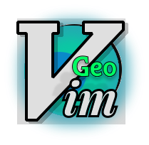

# geovim

GeoVim is a web-based map application with Vim-like keyboard controls.

Try it out here: [https://kkmcgg.github.io/geovim](https://kkmcgg.github.io/geovim) *(from the main branch)*



Logo Design: [Figma Link](https://www.figma.com/design/9nUlqxmkAjEHpfeZKSjtNM/geovim?node-id=0-1&p=f) *(work in progress)*

---

**This** is the (semi working) svelte version, probably soon to be the main branch

Based on an initial prototype: [Svelte Playground](https://svelte.dev/playground/f5b6778a8de540feb953679727df713e?version=5.34.1) *(are these public?)*

## Build
To build the project, run the following commands:

```bash
npm install
npm run dev
```
## Known Issues

* 'shift' is printed to console when using shift keys
* Movement controls can be janky/unresponsivei
* multiple gitignore files, package-lock.json sneaking through

## Currently Implemented Features (This Branch)

### Modes

* **NORMAL Mode:** Default mode for navigation and commands.
* **COMMAND_LINE Mode:** Enter by pressing `:` in NORMAL mode. Type commands and press `Enter` to execute. `Esc` returns to NORMAL mode.

### Navigation (NORMAL Mode)

* **Pan:**
  * `h`: Pan Left
  * `j`: Pan Down
  * `k`: Pan Up
  * `l`: Pan Right

### Command Line Mode (enter with `:`)

* `:zoom in`: Zoom in
* `:zoom out`: Zoom out
* `:help`: Show the help panel
* `:help close`: Close the help panel
* `:graph toggle`: Toggle graph visibility
* `:graph test`: Display a test sine wave graph
* `Enter`: Execute the typed command
* `Esc`: Exit Command Line Mode and return to NORMAL mode

## Features Implemented in Main Branch

### General Controls (NORMAL Mode)

* `?`: Toggle Help Panel
* `Esc`: Clear current command buffer / Cancel pending command / Close Help Panel

### Navigation (NORMAL Mode)

* **Pan:**
  * `w`: Pan Word Right (Large Pan)
  * `b`: Pan Word Left (Large Pan)
* **Zoom:**
  * `+` or `=`: Zoom In
  * `-`: Zoom Out
  * `zi`: Zoom In (Vim style)
  * `zo`: Zoom Out (Vim style)
  * `zz`: Center map and set zoom to a moderate level (10)
* **Go To:**
  * `gg`: Go To Top (World View - 0,0 coordinates, default zoom)
  * `G`: Go To "Home" (Predefined location - Nova Scotia)

### Command Line Mode (enter with `:`)

* `:set zoom <level>`: Set map zoom to `<level>` (e.g., `:set zoom 12`).
* `:goto <lon> <lat>`: Go to specified longitude and latitude (e.g., `:goto -71.05 42.36`).

### Markers (NORMAL Mode)

* `m{char}` (e.g., `ma`, `mb`): Set marker `{char}` (a-z) at the current map center.
* `'{char}` (e.g., `'a`, `'b`): Go to marker `{char}`.

## Planned Features

### Additional Modes
* **INSERT Mode:** Enter with `i`. `Esc` returns to NORMAL mode.
  * Vector editing operations
  * Raster operations
  * Geometry types
* **VISUAL Mode:** Enter with `v`. `Esc` returns to NORMAL mode.
  * Map region selection
  * Feature operations
  * Symbology controls
* **REPLACE Mode:** Quick coordinate editing and marker placement
* **TERMINAL Mode:** Execute map-related commands and scripts

### Enhanced Navigation
* **Search:**
  * `/`: Start forward search
  * `?`: Start backward search
  * `n`: Go to next search result
  * `N`: Go to previous search result
  * Search types:
    * `/place <name>`: Search for places
    * `/coord <lat> <lon>`: Search for coordinates
    * `/marker <name>`: Search for markers
    * `/feature <type>`: Search for features (points/lines/polygons)

### UI Elements
* **View Management:**
  * `:vsplit`: Split view vertically
  * `:hsplit`: Split view horizontally
  * `:only`: Close all other views
  * `Ctrl+w h/j/k/l`: Navigate between views
  * `Ctrl+w +/-`: Resize view height
  * `Ctrl+w </>`: Resize view width
  * `Ctrl+w =`: Equalize view sizes
  * `:q`: Close current view
  * `:qa`: Close all views

* **Layer View:**
  * `:Layers`: Open layer panel
  * Layer operations:
    * `dd`: Delete layer
    * `yy`: Copy layer
    * `p`: Paste layer
    * `u`: Move layer up
    * `d`: Move layer down
    * `t`: Toggle layer visibility
    * `o`: Toggle layer opacity
    * `i`: Toggle layer info
    * `s`: Toggle layer style
    * `f`: Toggle layer filter
  * Layer groups:
    * `za`: Toggle group expand/collapse
    * `zo`: Expand group
    * `zc`: Collapse group
    * `zR`: Expand all groups
    * `zM`: Collapse all groups

* **Table View:**
  * `:Table`: Open attribute table
  * Table operations:
    * `j/k`: Move up/down rows
    * `h/l`: Move left/right columns
    * `gg`: Go to first row
    * `G`: Go to last row
    * `0`: Go to first column
    * `$`: Go to last column
    * `/`: Search in table
    * `n/N`: Next/previous search result
    * `dd`: Delete selected rows
    * `yy`: Copy selected rows
    * `p`: Paste rows
    * `u`: Undo table changes
    * `Ctrl+r`: Redo table changes
  * Column operations:
    * `:sort`: Sort by column
    * `:filter`: Filter column
    * `:hide`: Hide column
    * `:show`: Show hidden columns
    * `:width`: Set column width

* **Graph View:**
  * `:Graph`: Open graph panel
  * Graph types:
    * `:graph bar`: Bar chart
    * `:graph line`: Line chart
    * `:graph pie`: Pie chart
    * `:graph scatter`: Scatter plot
    * `:graph histogram`: Histogram
  * Graph operations:
    * `z+`: Zoom in
    * `z-`: Zoom out
    * `zz`: Reset zoom
    * `h/j/k/l`: Pan graph
    * `r`: Rotate graph
    * `s`: Toggle series
    * `l`: Toggle legend
    * `g`: Toggle grid
    * `a`: Toggle axes
    * `t`: Toggle tooltips
  * Data operations:
    * `:graph data`: Select data source
    * `:graph x`: Set X axis
    * `:graph y`: Set Y axis
    * `:graph color`: Set color scheme
    * `:graph style`: Set graph style
    * `:graph export`: Export graph

* **Command Palette:**
  * `:cmd`: Open command palette
  * `Ctrl+p`: Quick command search
  * `Ctrl+space`: Show command suggestions
  * `Tab`: Cycle through suggestions
  * `Enter`: Execute command
  * `Esc`: Close palette

* **Status Bar:**
  * Shows current:
    * Mode
    * Coordinates
    * Zoom level
    * Projection
    * Selected features
    * Active layer
    * Command buffer

### Map Elements
* **Cartographic Components:**
  * `:scale`: Toggle scale bar
    * `:scale metric`: Set metric units
    * `:scale imperial`: Set imperial units
    * `:scale style`: Change scale bar style
    * `:scale position`: Set scale bar position
  * `:north`: Toggle north arrow
    * `:north style`: Change north arrow style
    * `:north size`: Set north arrow size
    * `:north position`: Set north arrow position
  * `:inset`: Manage inset maps
    * `:inset add`: Add new inset
    * `:inset remove`: Remove inset
    * `:inset style`: Change inset style
    * `:inset extent`: Set inset extent
    * `:inset position`: Set inset position
  * `:legend`: Manage map legend
    * `:legend show`: Show legend
    * `:legend hide`: Hide legend
    * `:legend style`: Change legend style
    * `:legend position`: Set legend position
    * `:legend title`: Set legend title
    * `:legend columns`: Set number of columns
  * `:annotation`: Manage annotations
    * `:annotation add`: Add new annotation
    * `:annotation edit`: Edit annotation
    * `:annotation remove`: Remove annotation
    * `:annotation style`: Change annotation style
    * `:annotation font`: Set annotation font
    * `:annotation size`: Set annotation size
    * `:annotation color`: Set annotation color
    * `:annotation align`: Set text alignment
    * `:annotation rotate`: Set text rotation

* **Export Options:**
  * `:export`: Export map
    * `:export png`: Export as PNG
      * `:export png size`: Set image size
      * `:export png dpi`: Set DPI
      * `:export png quality`: Set quality
      * `:export png transparent`: Toggle transparency
    * `:export pdf`: Export as PDF
      * `:export pdf size`: Set page size
      * `:export pdf orientation`: Set orientation
      * `:export pdf margin`: Set margins
      * `:export pdf metadata`: Set PDF metadata
    * `:export svg`: Export as SVG
      * `:export svg size`: Set image size
      * `:export svg style`: Set SVG style
    * Common options:
      * `:export title`: Set export title
      * `:export author`: Set author
      * `:export date`: Set date
      * `:export description`: Set description
      * `:export scale`: Include scale
      * `:export north`: Include north arrow
      * `:export legend`: Include legend
      * `:export grid`: Include grid
      * `:export coordinates`: Include coordinates
      * `:export watermark`: Add watermark
      * `:export preview`: Preview export
      * `:export save`: Save export settings
      * `:export load`: Load export settings

* **Layout Management:**
  * `:layout`: Manage map layout
    * `:layout new`: Create new layout
    * `:layout save`: Save layout
    * `:layout load`: Load layout
    * `:layout template`: Apply template
    * `:layout elements`: List layout elements
    * `:layout grid`: Toggle layout grid
    * `:layout snap`: Toggle element snapping
    * `:layout align`: Align elements
    * `:layout distribute`: Distribute elements
    * `:layout group`: Group elements
    * `:layout ungroup`: Ungroup elements

### Advanced Features
* **OpenLayers Integration:**
  * Image manipulation
  * Layer operations
  * Projection tools
  * Geometry operations
  * View controls

* **TurfJS Integration:**
  * Geospatial analysis
  * Buffer operations
  * Spatial queries
  * Measurements
  * Transformations

* **Overpass Turbo Integration:**
  * OSM data querying
  * Node/way/relation queries
  * Area queries
  * Bounding box queries
  * Query management
